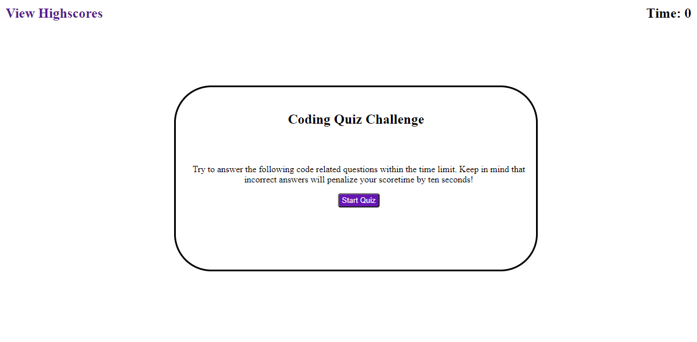
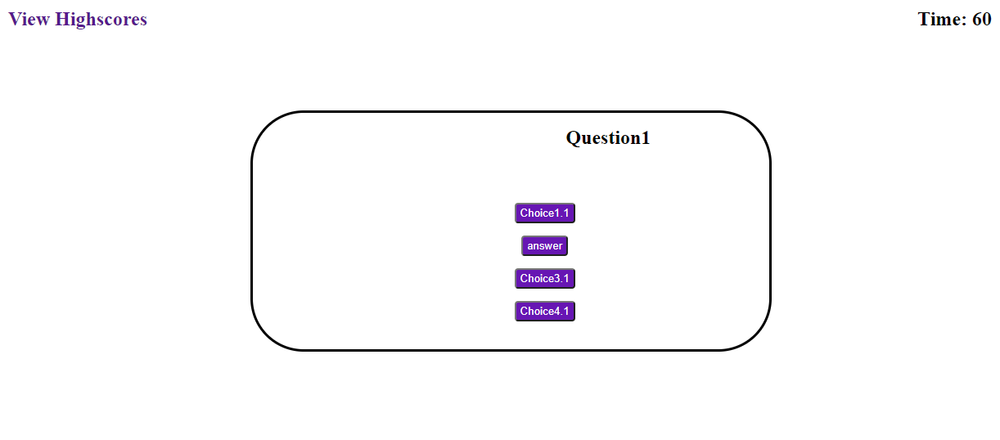
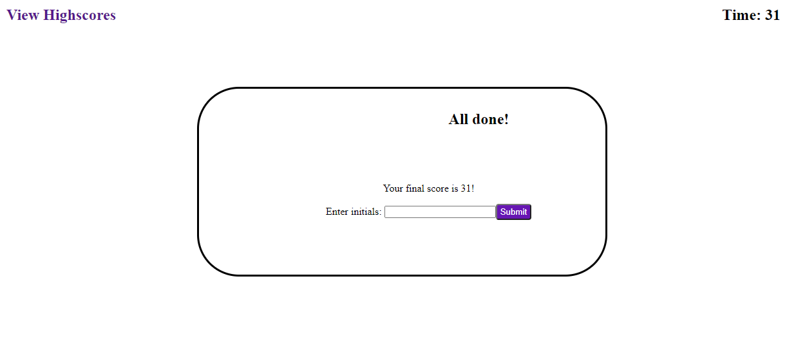
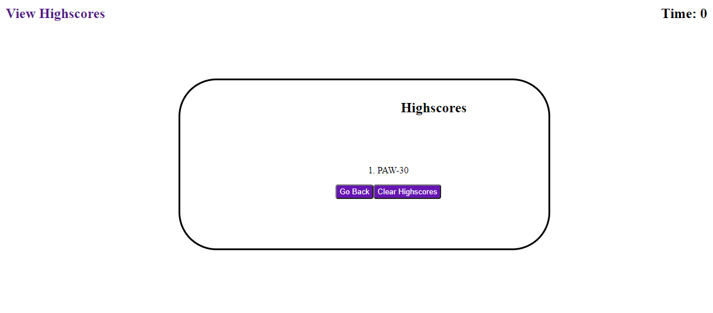

# Homework04_CodeQuiz
This application is a code quiz for boot camp students to test their knowledge on coding fundamentals. It will implement front and backend technologies learned in class featuring HTML, CSS, and JavaScript. 

## How it works
The user is displayed with a starting screen that shows a title, instructions, and a start button. It is recommended the user read instructions to know how to play, but not required. Instructions state the user must answer questions correctly to get a better score. Once the user clicks the start button the quiz begins. The user then is displayed with a question and four answer buttons once the user click an answer choice the next quesetion appears. The user should continue answer until the last question is answer, and the next screen appear which the user will enter their initials to be posted on the score board. The user is then shown the highscore screen and may choose to clear the board or go to the start screen again.

## Pictures

# Links

## Deployed project
https://paw6063.github.io/Homework04_CodeQuiz/

## Github Repository
https://github.com/PAW6063/Homework04_CodeQuiz
